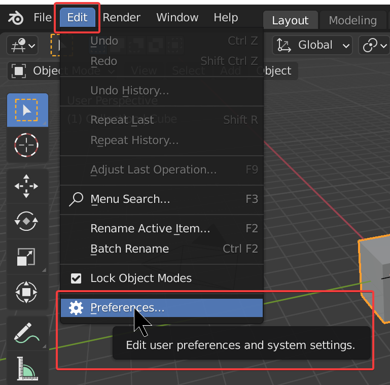
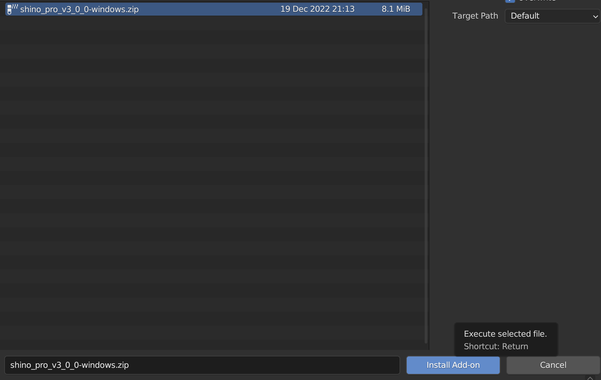
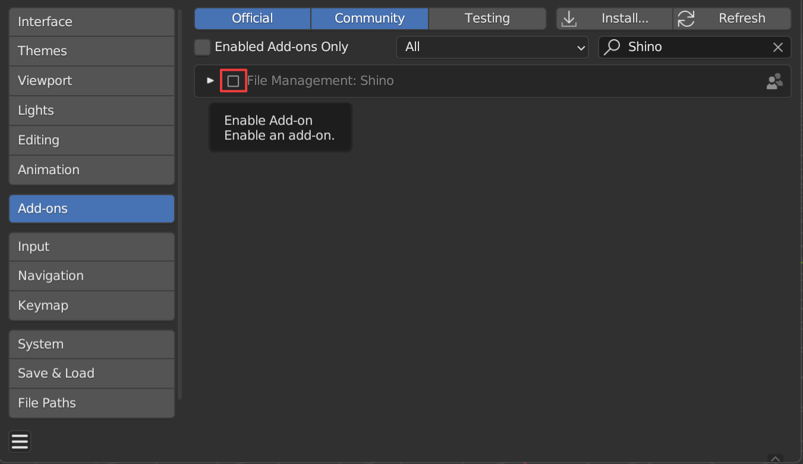
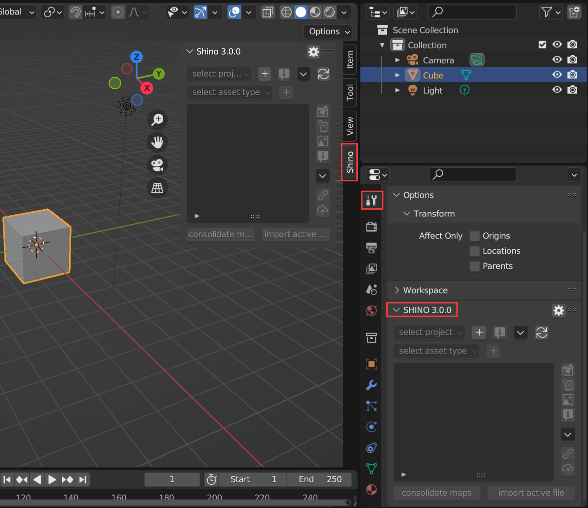
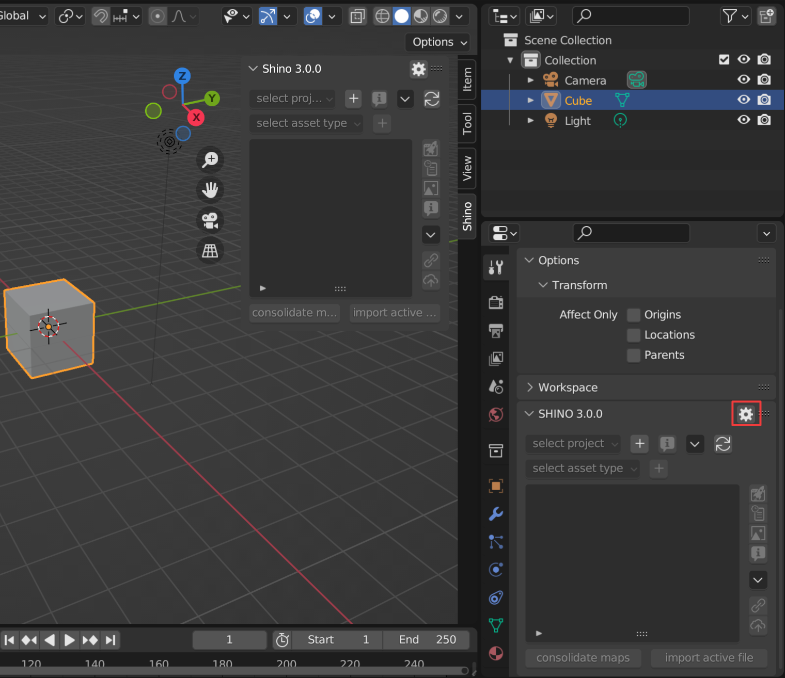

.. _getting_started:

Getting started
================

Requirements
------------

`Blender 2.8+ <https://www.blender.org/>`_

The official version on the website is always supported first and foremost but the developments also covers `Buildbot`_.

Addon Installation
--------------------------------

1. First, ensure Blender 2.8+ is up to date
----------------------------------------------
- `Blender.org <https://www.blender.org/download/>`_
- `Steam <https://store.steampowered.com/app/365670/Blender/>`_
- `Buildbot`_

2. Ensure the latest zips are downloaded
----------------------------------------------
Latest addon zip can be downloaded from the marketplace of origin.
- `Blendermarket <https://www.blendermarket.com/products/shino>`_
  
.. important::
    Do not unzip the downloaded files. Install the addons (.zip files) as explained below

3. Install from file/Enabling addon
----------------------------------------------
If updating, ensure you remove the previous version first.

Choose the zip that was downloaded and choose to install from file. After the installation is complete it will show up in the addon list.

This only works if the folder is not there already! Otherwise... issues.

In the addon panel locate Shino and remove it, then you will be able to install the newer update.

Enable addon by ticking the uppermost checkbox.

Ensure the previous addon folder is not there and it should work fine.

First Run
---------

Locate Shino panel in the Sidebar also called N Panel (You can also find Shino panel in the Active Tools and WorkSpace Setting). Click on th Shino tab to reveal it.

Preferences
------------
To easily access Shino preferences, you can use the settings button on the right side of the panel.

.. _Buildbot: https://builder.blender.org/download