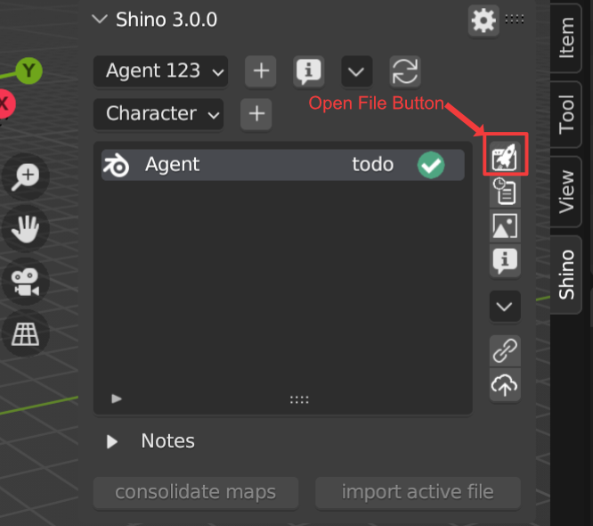

.. _usage:

Usage
======

.. note::
    Hey 👋, first time here? You can find the installation guide and first run in the :ref:`getting_started` section.

|

Creating/Editing Projects
--------------------------

Creating a Project
^^^^^^^^^^^^^^^^^^
Creating a new project is as easy as clicking the plus button beside the project filter menu,
give the project a name and a hourly rate if neccesary.

.. raw:: html

    <video width=100% nocontrols autoplay loop muted src="_static/img/creating_project.mp4"></video>

|

View/Editing Project Information
^^^^^^^^^^^^^^^^^^^^^^^^^^^^^^^^^
Select a Project you want, then click the file info button.
You will be able to view all information about the project including time spent on it
and other cost based on project rate.
You can also update project name from here.

.. image:: _static/img/project_info_menu.png
    :align: center

Project Extra Menu
^^^^^^^^^^^^^^^^^^
From the project extra menu, you can find options to view/edit project info, open the folder where your project is located,
or delete the project.

.. image:: _static/img/project_extra_menu.png
    :align: center

|

Creating/Editing Files
-----------------------

File Types
^^^^^^^^^^^
File types helps to categorize your files in sections that best fits its usage.
Currently Shino supports 4 file types; Characters, Props, Environments and Shots.

.. note::
    We plan to add support for custom file types to help fit your needs

.. image:: _static/img/file_types.png
    :align: center

|    

Creating a New File
^^^^^^^^^^^^^^^^^^^
Clicking the plus button beside the file type filter menu,
give the file a name and a hourly rate if neccesary and also a description.

.. raw:: html

    <video width=100% nocontrols autoplay loop muted src="_static/img/Creating_new_asset.mp4"></video>

|

Creating a New File from an Existing File
^^^^^^^^^^^^^^^^^^^^^^^^^^^^^^^^^^^^^^^^^^
Clicking the import active button will allow you to add the currently opened file to your project. This helps to simplify importation
of previous files created outside Shino.

.. image:: _static/img/import_active.png
    :align: center

|

Viewing/Editing File Information
^^^^^^^^^^^^^^^^^^^^^^^^^^^^^^^^^
Select a file you want to open, then click the file info button.
You will be able to view all informations about the file including time spent on it
and costs estimation based on project rate.
You can also update file name from here.

.. image:: _static/img/file_info.png
    :align: center

|

Opening a File
-------------------
Select the file you want to open and click the open button |open_file_icon|.
A green marker on the file will indicate the currently opened file.

If you want to load the file with its UI setup then select Load UI.

.. image:: _static/img/load_ui.png
    :align: center

|

File Task Status
-----------------
File task status can be changed through the file info pop up menu.
There are three status a file can be in; Todo, WIP (work in progress) and Done.

|

Notes
------
Notes allows you to store and keep important informations to be used later
during work.

.. image:: _static/img/notes.png
    :align: center

|

Version Control
----------------
Version controlling helps keep track on changes made over the period of a project.
This will enable you to revert to any previous state of a file safely.

|

File Modification Status
^^^^^^^^^^^^^^^^^^^^^^^^^
When a file is modified its modification status becomes red, this helps to tell files that haven't been published.

.. image:: _static/img/modified.png
    :align: center

|

Creating New Versions of File
^^^^^^^^^^^^^^^^^^^^^^^^^^^^^^
You can create new version of a file by clicking on the publish button |publish_file|.

.. note::
    You are advised to write a relevant message during publishing of file
    to help track changes easily.

.. raw:: html

    <video width=100% nocontrols autoplay loop muted src="_static/img/publish_version.mp4"></video>

|

Reverting to Previous Versions
^^^^^^^^^^^^^^^^^^^^^^^^^^^^^^
You can revert to any stored version of your file at anytime using the version history button |version_history|

.. raw:: html

    <video width=100% nocontrols autoplay loop muted src="_static/img/reverting_to_versions.mp4"></video>

|

Resetting a File
^^^^^^^^^^^^^^^^
When a file is modified you can reset it to the last published version using the revert button on the side menu.

.. image:: _static/img/reset_file.png
    :align: center

|

Creating Versions of Maps
^^^^^^^^^^^^^^^^^^^^^^^^^

.. note::
    Maps are images or videos wrapped around an object in 3d. They are basically textures and video used in a file.

All maps used in a file can be versioned. This is best used when painting a mask or texture, this will help you to version
different stages of your maps without having to save multiple files.

To start versioning of maps, you need to click on the consolidate maps button. This will find and create a new version history for all new maps that
haven't been consolidated previously.

.. image:: _static/img/consolidate_maps.png
    :align: center

After consolidating maps for a file, any new publish to that file will also create a new version for all modified maps.

|

View all Maps and Their state
~~~~~~~~~~~~~~~~~~~~~~~~~~~~~~
Clicking the maps version button shows a list of all maps belonging to the file.
A red icon signifies that a map has been modified.

.. image:: _static/img/maps_list.png
    :align: center

|

View Maps Version Log
~~~~~~~~~~~~~~~~~~~~~
Clicking the version log button on the maps list will display all published versions of the map.
You can revert to any version of the map from this menu.

.. image:: _static/img/maps_version_list.png
    :align: center

|

Video Demo of Maps Version Control
~~~~~~~~~~~~~~~~~~~~~~~~~~~~~~~~~~
.. raw:: html

    <video width=100% nocontrols autoplay loop muted src="_static/img/map_versioning.mp4"></video>

|

Importing from Other Shino Files
---------------------------------

Objects, Collections and Materials can be linked or appended between different files and projects easily by clicking the import selected button.

.. raw:: html

    <video width=100% nocontrols autoplay loop muted src="_static/img/linking_assets.mp4"></video>

|

.. |version_history| image:: _static/img/version_history.png
    :height: 25px

.. |publish_file| image:: _static/img/publish_file.png
    :height: 25px

