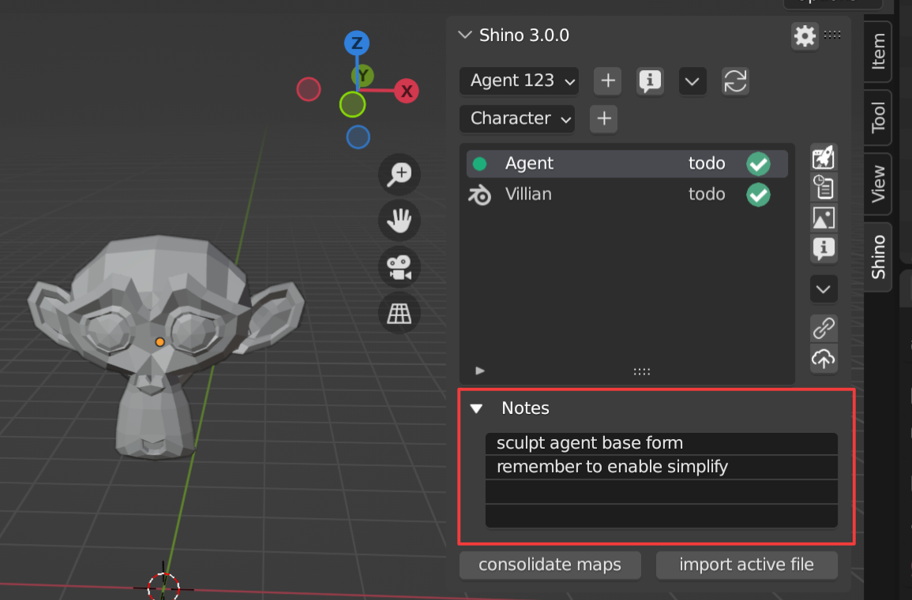

.. _usage:

Usage
======

.. note::
    Hey 👋, first time here? You can find the installation guide and first run in the :ref:`getting_started` section.

|

Creating/Editing Projects
--------------------------

Creating a Project
^^^^^^^^^^^^^^^^^^
Creating a new project is as easy as clicking the plus button beside the project filter menu,
give the project a name and a hourly rate if neccesary.

.. raw:: html

    <video width=100% nocontrols autoplay loop muted src="_static/img/creating_project.mp4"></video>

|

View/Editing Project Information
^^^^^^^^^^^^^^^^^^^^^^^^^^^^^^^^^
Select a Project you want, then click the file info button.
You will be able to view all information about the project including time spent on it
and other cost based on project rate.
you can also update project name from here

.. image:: _static/img/project_info_menu.png
    :align: center

Project Extra Menu
^^^^^^^^^^^^^^^^^^
From the project extra menu you can find options to view/edit project info, open the folder where your project in located,
or delete the project

|

Creating/Editing Files
-----------------------

File Types
^^^^^^^^^^^
File types helps to categorize your files in sections that best fits it usage.
Currently Shino supports 4 file types Characters, Props, Environments and Shots.

.. note::
    We plan to add support for custom file types to help fit your needs

.. image:: _static/img/file_types.png
    :align: center

|    

Creating a New File
^^^^^^^^^^^^^^^^^^^
Clicking the plus button beside the file type filter menu,
give the file a name and a hourly rate if neccesary and also a description.

.. raw:: html

    <video width=100% nocontrols autoplay loop muted src="_static/img/Creating_new_asset.mp4"></video>

|

Creating a New File from a Existing File
^^^^^^^^^^^^^^^^^^^^^^^^^^^^^^^^^^^^^^^^^^
Clicking the import active button will allow to to add the currently opened file to your project, this help to simplify importation
of previous files create outside of shino

|

View/Editing File Information
^^^^^^^^^^^^^^^^^^^^^^^^^^^^^^
Select a file you want to open, then click the file info button.
You will be able to view all information about the file include time spent on it
and other cost based on project rate.
you can also update file name from here

.. image:: _static/img/file_info.png
    :align: center

|

Opening a File
-------------------
Select the file you want to open, then click the open button |open_file_icon|.
A green marker on the file will indicate the currenly opened file

.. image:: _static/img/open_file.png
    :align: center

If you want load the file with its ui setup then select Load UI

.. image:: _static/img/load_ui.png
    :align: center

|

File Task Status
-----------------
File task status can be changed throught the file info pop up menu.
there are three status a file can be in Todo, WIP (work in progress) and Done

.. image:: _static/img/task_status.png
    :align: center

|

Notes
------------------------------
notes allows you to store and kept important information to be used later
during work

|

Version Control
----------------
Version cotrolling helps keep track on changes made over the period of a project.
This will enabled you to revert to any previous state of a file safely

|

File Change Status
^^^^^^^^^^^^^^^^^^^
When a file is modified it change status becomes red this help to tell files that havent been published

.. image:: _static/img/modified.png
    :align: center

.. image:: _static/img/file_change_status.png
    :align: center

|

Creating New Versions of File
^^^^^^^^^^^^^^^^^^^^^^^^^^^^^^
you can create new version of a file by pressing the publish button |publish_file|.

.. note::
    you are advised to write a relevant message during publishing of file
    to help track changes easily

.. raw:: html

    <video width=100% nocontrols autoplay loop muted src="_static/img/publish_version.mp4"></video>

|

Reverting to Previous Versions
^^^^^^^^^^^^^^^^^^^^^^^^^^^^^^
You can revert to any stored version of your file at any time using the version history button |version_history|

.. raw:: html

    <video width=100% nocontrols autoplay loop muted src="_static/img/reverting_to_versions.mp4"></video>

|

Reset File
^^^^^^^^^^^
When a file is modified you can reset it to the last published version using the revert button on the side menu

|

Versioning Maps
^^^^^^^^^^^^^^^^

.. note::
    Maps are images or videos wrapped around an object in 3d, they are basically textures and video used in a file

all maps used in a file can be versioned, the is expectial useful when you are painting a mask/textures, this will help you to version
different stages of your maps without having to save multiple.

To start versioning of maps you need to press the consolidate button, this will find and create a new version history for all new maps that
havent been consolidated previously

after consolidating maps for a file, any new publish to that file will also create a new version for all modified maps

|

View all Maps and Their state
~~~~~~~~~~~~~~~~~~~~~~~~~~~~~~
pressing the maps version button shows a list of all maps belonging to the file
a red icon signifies the map has been modified

|

View Map Version Log
~~~~~~~~~~~~~~~~~~~~
presing the version log button on the maps list with display alway published versions of the map,
you can revert to any version of the map from this menu

|

Video Demo of Map Version Control
~~~~~~~~~~~~~~~~~~~~~~~~~~~~~~~~~~
.. raw:: html

    <video width=100% nocontrols autoplay loop muted src="_static/img/map_versioning.mp4"></video>

|

Importing from Other Shino Files
---------------------------------

Object, Collection and Material can be linked or appended better different files or even projects easily by pressing the import seleted button,

.. raw:: html

    <video width=100% nocontrols autoplay loop muted src="_static/img/linking_assets.mp4"></video>

|

.. |open_file_icon| image:: _static/img/open_file_icon.png
    :height: 25px
